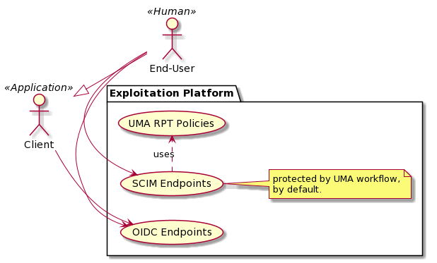

[[mainOverview]]
= Overview

== Building Block Overview

[NOTE]
.Content Description
================================
This section contains:

* High-Level Description of the Building Block
* Context within EOEPCA
================================

The Login Service building block provides an OIDC and UMA compliant solution enabling authentication and authorization mechanisms within an Exploitation Platform. Other building blocks, such as the Policy Decision Point, Policy Enforcement Point and User Profile rely on this Building Block to provide several standard interfaces.

As stated in the EOEPCA Master System Design Document (ref. [PENDING]), the Login Service establishes itself as a client (Relying Party) for external Identity Providers (IDPs) allowing users coming from external domains to authenticate into the Exploitation Platform. In addition to this functionality, the Login Service also allows any Platform component to authenticate itself (without the need for an End-User to initiate the flow) therefore facilitating security aspects of the internal workflows of a Platform.

The figure below, identifies the main workflows on which the Login Service participates:

image::../images/workflow.png[top=5%, align=center, pdfwidth=6.5in]

Based on this workflow, the Login Service enables the following functionality aspects:

=== End-User Authentication through external IDPs

The Login Service establishes itself as a client to all supported external IDPs, with the necessary trust relationships in place to support the authentication flow. End-Users participating in this flow will propagate - with their necessary consent - a subset of the information stored in the external IDP into the Login Service back-end in order to facilitate unique identification of users and the Billing and Accounting functionalities of the overall Platform.

==== Authentication Flow

The following image indicates the sequence of events necessary for a user to authenticate using an external Identity Provider (IDP).

image::../images/passport.png[top=5%, align=center, pdfwidth=6.5in]

==== Unique identification of End-Users

By default, the Login Service extracts the email account stored in the external Identity Provider and checks that the user has not logged in previously with any other external IDP under the same email account. Whenever that's the case, the authentication flow skips the persistence of End-User attributes to the back-end and directly considers the user authenticated.

=== Single Sign-On

Single Sign-On (SSO) comes as one of the main benefits of using OIDC as authentication standard, allowing Service Providers (Client Applications) that utilize the Login Service to skip the step that requires input of credentials by the end-user if the Login Service detects that a session for the user is ongoing within the platform.

=== Single Log-Out

Similar to the SSO functionality, applications can request the End-User session to be terminated across the platform, and register themselves to receive this log-out request (in order to also handle it internally).

=== Authorization Scopes

Authorization scopes are definitions used to protect resources, by enabling associated policies that ensure a connecting client has the access permissions required for a given resource.

==== Public Access

This specific scope allows for any end user or client application to freely access a resource, without any restrictions.

==== Authenticated Access

This scope is associated with a policy that verifies if the user, making the request, has an ongoing active session.

==== Protected Access

This scope delegates user verification to the https://github.com/EOEPCA/um-pdp-engine[Policy Decision Point (PDP)] building block, via XACML-compliant communication.

== Static Architecture

[NOTE]
.Content Description
================================
This section contains:

* Diagram and description of the major logical components within the Building Block

================================

The Login Service heavily relies on Free and Open Source Software that already implements the interfaces and functionality required. The following diagram describes the main components of this building block:

image::../images/static.PNG[top=5%, align=center, pdfwidth=6.5in]

* The Authentication and Authorization Service enables both OIDC and UMA flows for the whole Platform
* The Administration Service provides and Administration GUI and a SCIM Implementation allowing direct interaction with the End-User Back-End
* The Back-End Service stores the necessary information for the other components to provide Session Management, Authorization and persists external IDP information generated or relayed during authentication.
* The Relying Party component allows to register as a RP in any external IDP.

The Section for the Building Block Design [<<mainComponents>>] contains detailed descriptions and references to the Open Source components used in this Building Block.

== Use Cases

[NOTE]
.Content Description
================================
This section contains:

* Diagrams and definition of the use cases covered by this Building Block

================================

image::../images/sessions.png[top=5%, align=center, pdfwidth=6.5in]
This diagram covers the following use cases:

=== Single Sign-on
Upon performing a Login action, a new Session is generated that is then used by the user to perform actions on the Exploitation Platform.

=== Single Log-out
Upon performing a Logout action, the created Session is destroyed, preventing further action by the End-User on the Exploitation Platform, until a new Login action is taken.

=== End-User chooses Identity Provider
When performing a Login action, the End-User can choose if they wish to use an External Identity Provider to delegate authentication (or use the Login Service itself).

=== External Identity Provider Authentication
If an External Identity Provider is chosen to delegate authentication, the Login Service redirects to it in order to proceed with the Login action. This is best explained by the sequence diagram present in [<<_authentication_flow>>]

This diagram covers the following use cases:

=== UMA workflow
By default, some actions are protected by a UMA (User-Managed access) workflow, that is already described in the Master System Design document (ref. [PENDING]). As part of this process, any security policies that have been previously established as [[<<_authentication_scopes>>]] are enacted.

=== Request User Attributes through SCIM
Requesting a User's attributes can be done via SCIM's .well-known endpoints, best by using a previously registered client to call them and perform UMA authentication.

=== Resource registration
Resource registration can be done directly via OIDC's .well-known endpoints, best by using a previously registered client to call them using basic authentication.

=== Dynamically register a client
The Exploitation Platform allows a client to dynamically register with itself, by calling OIDC .well-know endpoints.

== External Interfaces

[NOTE]
.Content Description
================================
This section contains:

* Listing of technical external interfaces (with other Building Blocks)

================================

=== Authentication (AuthN) Interface

The Login Service exposes an OpenID Connect interface through a .well-known URI that describes all standard endpoints.

=== Authorization (AuthZ) Interface

The Login Service exposes a User Managed Access (UMA) interface through a .well-known URI that describes all standard endpoints.

=== Identity Management Interface

The Login Service exposes a System for Cross Domain Identity (SCIM) Interface through a .well-known URI that describes all standard endpoints.

=== Administration Interface

A web service is made available for administrators and operators to manage the configuration aspects of the Login Service without the need to authenticate using external IDPs.

=== External IDP Discovery Interface

A landing web page interface for Authentication Requests is made available, allowing users to select their preferred external IDP and initiate authentication flow.

== Required Resources

[NOTE]
.Content Description
================================
This section contains:

* List of HW and SW required resources for the correct functioning of the building Block
* References to open repositories (when applicable)

================================

=== Software

The following Open-Source Software is required to support the deployment and integration of the Login Service:

* Authentication and Authorization Service
** oxAuth - Gluu Inc. - https://github.com/GluuFederation/oxAuth
* Administration Service
** oxTrust - Gluu Inc. - https://github.com/GluuFederation/oxTrust
* Back-end Service
** OpenDJ/LDAP Distribution - https://github.com/GluuFederation/docker-opendj
* OIDC Compliant, extensible Relying Party
** Passport.js - https://github.com/jaredhanson/passport
* Deployment, Configuration and Integration Tooling
** Persistence system load/backup/restore components - https://github.com/EOEPCA/um-login-persistence
** Kubernetes secret and config Tooling - https://github.com/GluuFederation/gluu-docker/tree/3.1.6/examples/kubernetes/minikube
** Reverse Proxy exposing API interfaces - Nginx/Ingress

