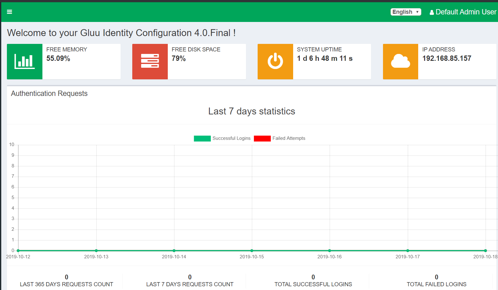
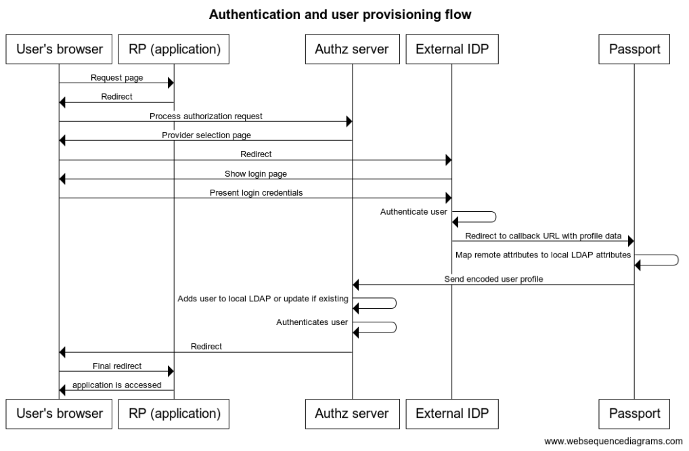

[[mainComponents]]
= Building Block Design

[NOTE]
.Content Description
================================
This section contains:

* A concise breakdown of the Building Block in several independent services (when applicable). For each component, the following subsections are added:
** Overview and purpose: indicating the functionality covered by the component
** SW Reuse and Dependencies: indicating reuse of third party open source solutions (if any) and any pre-required Dependencies
** Interfaces: both internal to the building block and those exposed externally
** Data: Data usage of the building block, data flow and any GDPR concerns should be addressed here
** Applicable Resources: links and references to (Reference Docs), and repositories.

When a breakdown is necessary, a general overview of the building block can be given. On the contrary, no breakdown indicates a single component development with the same expected sections.

================================

== Authentication and Authorization Service
=== Overview and Purpose
The login service provides both authentication and authorization via it's oxAuth component. This component also provides the OpenID Connect (OIDC) and UMA flows, exposed through endpoints to external clients.

It also provides authentication via web service, allowing for simple login interactions with users.

=== Software Reuse and Dependencies
This service depends solely on oxAuth software, from gluu (see applicable resources and the overview for this building block)

=== Interfaces
==== OIDC Endpoints
A listing of endpoints to interact with OIDC is exposed on a .well-know URL (default is .well-known/openid-configuration).

==== UMA Endpoints
A listing of endpoints to interact with UMA is exposed on a .well-know URL (default is .well-known/uma2-configuration).

=== Data
==== Configuration

Configuration is obtained via the persistance module, which loads scripts, custom html, and data to LDAP and/or their respective places.

Direct customization without the "persistance" module is not possible at this time.

==== Data flow

All information handled by this service is read/written to the LDAP instance deployed at the backend.

=== Applicable Resources

* oxAuth (gluu) - https://gluu.org/docs/de/reference/oxauth/
* oxAuth (gluu @ Github) - https://github.com/GluuFederation/docker-oxauth

== Administration Service
=== Overview and Purpose

The login service provides administration functionality for users with elevated priviledges. This allows admins to have an overview of the entire system, as well as configure anything necessary from this interface. Some of the configurations available from it are:

- OAuth Clients
- UMA Scopes & Resources
- Edit/Add/Remove Users

A complete description of available configurations can be found here: https://gluu.org/docs/gluu-server/4.1/admin-guide/oxtrust-ui/#oxtrust-admin-gui

=== Software Reuse and Dependencies

- **oxTrust**: A gluu component, providing the web interface and interaction
- **opendj**: The instance of LDAP providing the backend store for information

=== Interfaces
==== SCIM Endpoints
A listing of endpoints to interact with SCIM is exposed on a .well-know URL (default is .well-known/scim-configuration).

==== Web Interface
A web interface is exposed to allow administrators and local operators to login and manage configuration aspects of the Login Service.

=== Data
==== Configuration

Configuration is obtained via the persistance module, which loads scripts, custom html, and data to LDAP and/or their respective places.

Direct customization without the "persistance" module is not possible at this time.

==== Data flow

All information handled by this service is read/written to the LDAP instance deployed at the backend.

=== Applicable Resources

* oxTrust (gluu) - https://gluu.org/docs/de/reference/oxtrust/
* oxTrust (gluu @ Github) - https://github.com/GluuFederation/docker-oxtrust

== Back-End Service
=== Overview and Purpose

The backend service is composed of the opendj component, which serves an LDAP service, storing all of the data and configuration of the platform.

=== Software Reuse and Dependencies 

- **opendj**: The instance of LDAP providing the backend store for information

=== Interfaces
Not applicable, all actions are done internally on the LDAP instance.

=== Data 
==== Data Flow

The service itself doesn't process data, but stores it in an LDAP database.
Thus, all flows follow the LDAP protocol for connection and exchange of data.

==== Configuration

There is no configuration available for this service at this time

=== Applicable Resources

- Persistance, LDAP - Gluu - https://gluu.org/docs/gluu-server/reference/persistence/#ldap
- OpenDJ, docker - https://github.com/GluuFederation/docker-opendj

== Relying-Party Service
=== Overview and Purpose
Gluu has a bundled middleware project called Passport.js, the purpose of which is to facilitate authentication using an external identity provider. To this end, the OIDC interface can be called by an IDP.

=== Software Reuse and Dependencies
- **oxTrust**: A gluu component, providing the web interface and interaction
- **passport**: Gluu's container instance of Passport.js' implementation

=== Interfaces
==== OIDC Endpoints
A listing of endpoints to interact with OIDC is exposed on a .well-know URL (default is .well-known/openid-configuration).

=== Data
==== Data Flow

==== Configuration

Configuration is obtained via the persistance module, which loads scripts, custom html, and data to LDAP and/or their respective places.

Direct customization without the "persistance" module is not possible at this time.

=== Applicable Resources

- Passport.js - http://www.passportjs.org/
- Passport (Github) - https://github.com/jaredhanson/passport
- oxPassport (gluu) - https://gluu.org/docs/de/reference/oxpassport/
- oxPassport (gluu @ Github) - https://github.com/GluuFederation/docker-oxPassport

== Logging
=== Design

Logging accross the EOEPCA Building Blocks works much in the same way, by usage of a log helper class to initiate a Python logger, handler and formater that simultaneously outputs log messages to console and a log file. These log files are set on a rotation, with a 1GB limit per each, with the 10 latest log files being kept in memory.

A new configuration yaml file is added to the building block, containing initialization parameters.

=== Log message format

INFO level log messages follow the following format:

 * TIME: in ISO 8601 format, "%Y-%m-%dT%H:%M:%S%z"
 * LEVELNAME: INFO by default
 * COMPONENT: "LGS"
 * SUBCOMPONENT: OxTrust or OxAuth
 * ACTION IDENTIFIER: N/A
 * ACTION TYPE: AUTHORIZATION or AUTHENTICATION
 * LOG CODE: Unique code identifying log message type
 * ACTIVITY: Detailed log message, check reference table

=== Log message codes

Subcomponent division is as follows:

 * 00xx: OxTrust
 * 01xx: OxAuth

.Log Codes
|===
|Log Code |Structure

|0001
|{"User":user,"Description":"Invalid JWT signature","JWT":jwt}

|0002
|{"User":user,"Description":"Expired JWT","JWT":jwt}

|0003
|{"User":user,"Description":"User authenticated","JWT":jwt}

|0004
|{"User":user,"Description":"User authentication failed","JWT":jwt}

|0005
|{"User":user,"Description":"No provider, basic auth completed"}

|0006
|{"User":user,"Description":"No provider, basic auth failed"}

|0007
|{"User":user,"Description":"Pre-registered provider, authenticating"}

|0008
|{"User":user,"Description":"Mail login, email value missing, authentication failed"}

|0009
|{"User":user,"Description":"Mail login, authentication completed"}

|0010
|{"User":user,"Description":"Mail login, authentication failed"}

|===